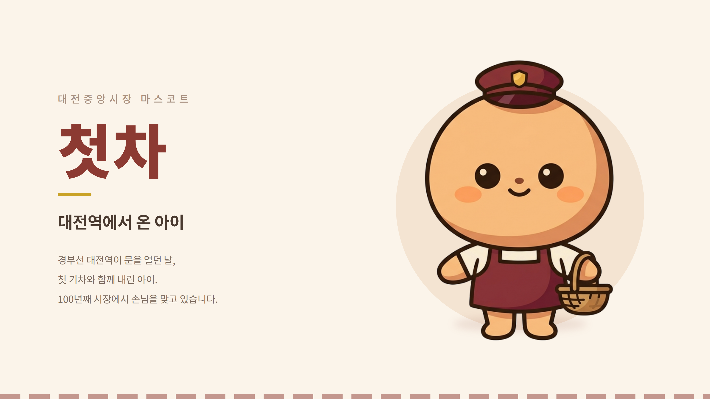

[← 전체 제출작 보기](../README.md)

# 🚂 대전 중앙시장 마스코트 「첫차」

**AI 캐릭터·브랜딩 콘텐츠** 부문 · 대전·논산 AI·SW 활용 콘텐츠 경진대회 · 팀 시장에가면 (전체 직접 제작)



## 캐릭터 소개

> **대전역에서 온 아이**<br>
> 경부선 대전역이 문을 열던 날, 첫 기차와 함께 내린 아이.<br>
> 100년째 시장에서 손님을 맞고 있습니다.

- **이름 「첫차」**: 경부선 대전역의 첫 기차와 함께 내린 아이라는 뜻
- **디자인**: 대전역을 떠올리게 하는 **역장 모자** + 중앙시장을 떠올리게 하는 **앞치마와 장바구니**
- **스타일**: 2등신, 굵은 외곽선의 플랫 2D 스티커 스타일 (1990년대 한국 마스코트 느낌)

| 컬러 | 코드 | 쓰임 |
|---|---|---|
| 살구 베이지 | `#F2C6A0` | 얼굴·몸 |
| 버건디 | `#8C3A32` | 역장 모자·앞치마 |
| 크림 | `#F7EFE2` | 셔츠 |
| 다크 브라운 | `#2B2018` | 외곽선 |

## 이미지 생성 프롬프트

이미지 생성 AI에 입력한 프롬프트입니다. 모양·색·스타일을 항목별로 나누고, 원하지 않는 표현(그라데이션, 3D, 광택 등)은 `NO`로 막았습니다.

```text
A cute 2-head-tall mascot character, Korean traditional market mascot,
retro railway theme.

HEAD: a large round head taking up half the total height, warm apricot
beige color, smooth and simple.
HAT: a SMALL deep burgundy railway station master cap sitting on top of
the head, with a short flat angular brim pointing forward and a tiny
gold badge on the front. The cap is small and does not cover the head.
BODY: a clearly separate small rounded body below the head, noticeably
narrower than the head, wearing a deep burgundy market apron over a
cream shirt.
ARMS: short stubby arms held out away from the body, not touching it.
One hand holds a small woven market basket.
LEGS: two short simple legs with clearly separated rounded feet.
FACE: large round black eyes in the upper half of the head, tiny
smiling mouth, soft peach cheek blush.

COLOR PALETTE: apricot beige #F2C6A0, deep burgundy #8C3A32,
cream #F7EFE2, dark brown outline #2B2018.

STYLE: flat 2D vector illustration, thick uniform outline, cel-shaded
with only 2 flat tones per color, NO gradient, NO texture, NO 3D
rendering, NO Pixar style, NO glossy highlights.
1990s Korean mascot design language, sticker-like, clean and simple.

Plain pure white background, full body, front view, centered.
```
