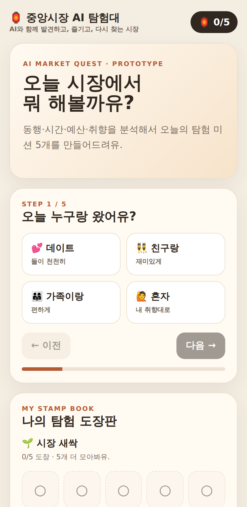
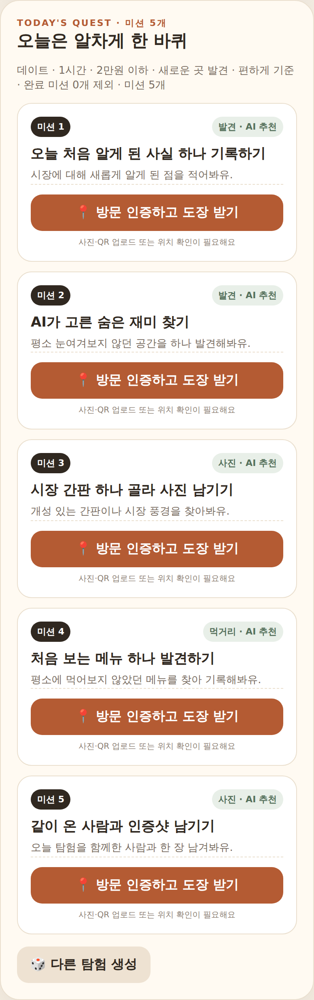
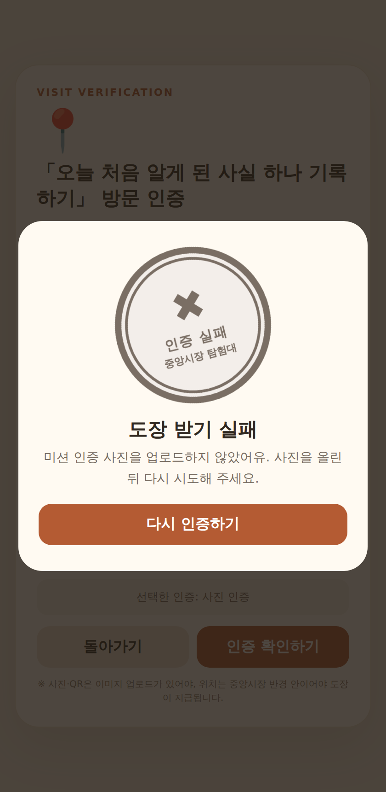
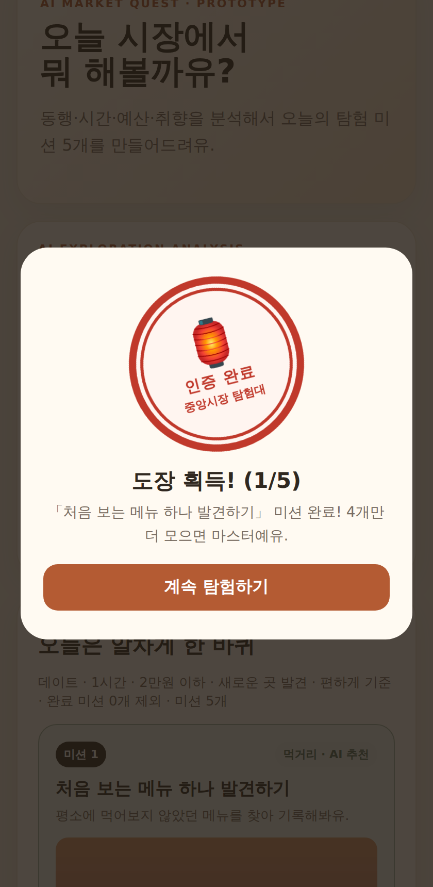
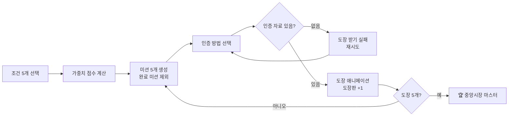

[← 전체 제출작 보기](../README.md)

# 🏮 중앙시장 AI 탐험대

**지역 활성화 아이디어 콘텐츠** 부문 · 대전·논산 AI·SW 활용 콘텐츠 경진대회 · 팀 시장에가면 (팀원과 공동 제작 · Claude 활용 개발 담당)

> 방문객의 동행·시간·예산·취향을 분석해 **대전 중앙시장 맞춤 탐험 미션 5개**를 만들고, **방문 인증에 성공해야만 도장을 주는** 모바일 웹 프로토타입

**🔗 Live Demo:** https://jungang-market-ai-explorer.netlify.app/


| 조건 선택 | 미션 5개 생성 | 인증 실패 | 도장 획득 |
|:---:|:---:|:---:|:---:|
|  |  |  |  |

---

## 1. 기획 배경

| 문제 | 해결 아이디어 |
|---|---|
| 전통시장 방문객이 **입구 근처 몇 곳만 보고 떠남** | 조건별로 다른 **탐험 미션**을 줘서 시장 안쪽까지 걷게 만들기 |
| 한 번 오고 **다시 오지 않음** | **도장판(5칸)**과 완료 미션 제외 → 재방문 동기 |
| 도장만 받고 실제로는 **미션을 하지 않음** | **사진·QR 업로드 또는 GPS 확인**이 있어야만 도장 지급 |

## 2. 주요 기능

- **5단계 조건 분석**: 동행(데이트/친구/가족/혼자) · 체류 시간 · 예산 · 목적 · 탐험 방식
- **맞춤 미션 5개 생성**: 15개 미션 풀에서 가중치 점수로 선택, 같은 카테고리는 최대 2개까지만 넣어 다양하게 구성
- **완료 미션 제외**: 이미 인증한 미션은 다음 탐험에서 다시 나오지 않음
- **3가지 방문 인증**
  - 📷 사진 인증 / ▣ QR 인증: 이미지를 업로드해야 통과 (미리보기 제공)
  - 📍 위치 인증: Geolocation API로 시장 중심에서 **700m 이내**인지 계산 (Haversine 공식)
- **인증 실패 처리**: 자료가 없으면 카드가 흔들리고 회색 ✖ 도장과 함께 "도장 받기 실패" 표시
- **도장 애니메이션**: 도장이 찍히는 효과, 잉크 퍼짐, 카운터 강조, 5개 달성 시 색종이 효과
- **진행 저장**: `localStorage` 사용 (저장이 막힌 환경에서도 에러 없이 동작)

## 3. 동작 흐름



## 4. 핵심 로직

### 미션 추천 점수

```js
score = random(0~10)
      + (목적 일치 ? 25 : 0)
      + (동행 일치 ? 10 : 0)
      + (탐험 방식 일치 ? 8 : 0)
      + (새로운 곳 선호 && 발견형 미션 ? 15 : 0)
      + (5천원 이하 && 저가 간식 미션 ? 20 : 0)
```

- 조건과 맞는 미션이 위로 올라오고, 무작위 값 때문에 같은 조건이어도 매번 조금씩 다른 조합이 나옵니다.
- **참고:** 현재 버전은 LLM을 호출하지 않는 **규칙 기반 추천**입니다. 실제 운영 단계에서 LLM·점포 데이터와 연동하는 것을 전제로 한 프로토타입입니다.

### 인증 검증 (도장 지급 조건)

```js
if (method === "위치")   ok = geoOk;          // 반경 700m 이내
else                     ok = !!uploadedImg;  // 사진·QR 이미지 업로드
if (!ok) return showFail();                   // 도장 지급 안 함
```

## 5. 개발 과정 & 트러블슈팅

| 문제 | 원인 | 해결 |
|---|---|---|
| 도장판은 5칸인데 미션은 3개 | 미션 선택 반복문이 3개에서 종료 | `GOAL=5` 상수로 통일 |
| 사진 없이도 도장 지급 | 인증 방법만 고르면 성공 처리 | 업로드/위치 결과를 검사하는 단계 추가 |
| 도장 기록이 화면에 안 나옴 | 요소 id `history`가 브라우저 내장 `window.history`와 이름 충돌 | id를 `historyList`로 바꾸고 `getElementById`로 접근 |
| 배포 후 사이트 접속 불가 | Netlify 신규 프로젝트가 기본 **Private** | 대시보드에서 **Make public** |

## 6. AI 활용 방식

이 프로젝트는 **생성형 AI를 개발 도구로 활용**해 만들었습니다.

- **ChatGPT**: 초기 프로토타입 생성, Netlify 배포
- **Claude** (본인 담당): 코드 리뷰, 버그 원인 분석, 기능 추가(미션 5개·인증 검증·애니메이션), 배포본 검증
- 같은 결과를 다시 만들 수 있도록 사용한 요구사항을 [`PROMPT.md`](PROMPT.md)에 정리했습니다.
- 대회 제출 때 단계별(기획 → 제작 → 보완 → 배포)로 사용한 프롬프트는 [`docs/prompt-history.md`](docs/prompt-history.md)에 있습니다.

## 7. 실행 방법

빌드 과정이 없는 **HTML 파일 하나**로 되어 있습니다.

```bash
git clone https://github.com/phj-plan/daejeon-nonsan-aisw-contest.git
cd daejeon-nonsan-aisw-contest/regional-idea
# index.html을 브라우저로 열기
```

> 카메라·위치 기능은 **https 환경**에서만 동작합니다. 모바일 테스트는 배포 주소를 이용하세요.

## 8. 향후 계획

- [ ] 참여 점포별 실제 QR 코드 발급 및 서버 검증
- [ ] LLM API 연동으로 자연어 미션 생성
- [ ] 도장 5개 달성 시 상인회 쿠폰 연동
- [ ] 점포 지도 및 미션 위치 표시

## 9. 파일 구조

```
regional-idea/
├── index.html              # 전체 앱 (HTML + CSS + JS)
├── PROMPT.md               # AI 재현용 프롬프트
├── README.md
└── docs/
    ├── 01~04-*.png         # README 스크린샷
    └── prompt-history.md   # 대회 제출 시 단계별 사용 프롬프트
```

---

<sub>대전·논산 AI·SW 활용 콘텐츠 경진대회 지역 활성화 아이디어 콘텐츠 부문 제출용 프로토타입입니다. 실제 QR/위치/사진 인증 및 쿠폰은 운영 단계에서 참여 점포·상인회와 연동하는 것을 전제로 합니다.</sub>
